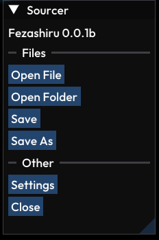
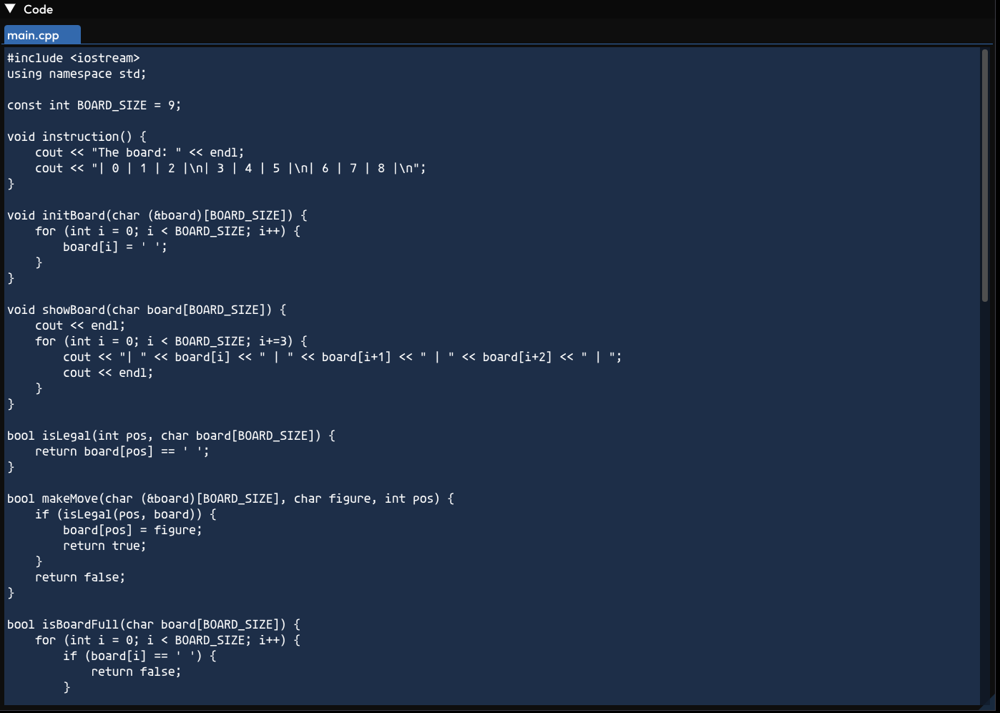

# Fezashiru - Your ImGui-based IDE
> #### **NOTE:** Fezashiru is only in pre-alpha. There can be some bugs. You can always report about it at [fezashiru discord server](https://discord.gg/4UmmWeQfWT)!

## Contents
1. [About](#about-fezashiru)
2. [Screenshots](#screenshots)
3. [Roadmap](#roadmap)
4. [How to build](#how-to-build)
5. [Credits](#credits)

## About Fezashiru
Fezashiru is an IDE that uses ImGui as main UI and GLFW for window rendering. Fezashiru contains 5 main panels:
```
1. Sourcer - Main panel
2. Editor - Code editor
3. Explorer - Just a file explorer
4. Project Tree - all files of project
5. Viewer - Allows to view images
```

## Screenshots




## Roadmap
### Done:
- Files selecting
- Code Editor
- Events
- Image viewing
- Configs
### Plans:
- Recent folders
- User themes
- Code highlighting

## How to build
You must install GLFW and ImGui. Then write `make` to the terminal.

## Credits
by hithja with love❤️